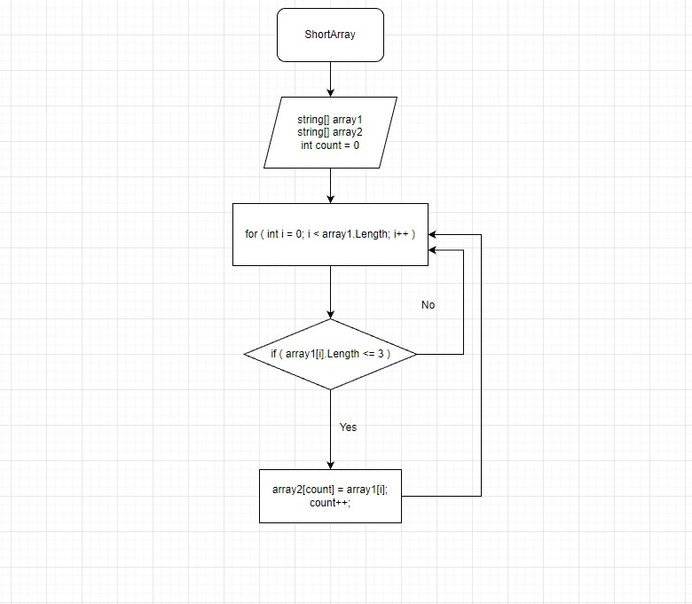

# Final Work

## Задача:
* Написать программу, которая из имеющегося массива строк формирует новый массив из строк, длина которых меньше, либо равна 3 символам. Первоначальный массив можно ввести с клавиатуры, либо задать на старте выполнения алгоритма. При решении не рекомендуется пользоваться коллекциями, лучше обойтись исключительно массивами.

## Примеры:
* [“Hello”, “2”, “world”, “:-)”] → [“2”, “:-)”]
- [“1234”, “1567”, “-2”, “computer science”] → [“-2”]
+ [“Russia”, “Denmark”, “Kazan”] → []

## Решение:
* Объявляем **_два_** массива. Далее описываем **_метод_** в котором цикл соответствует длинне массива, внутри цикла проверяем условие **( <= 3 )**, если подходит, то первый элемент заносится в **count** второго массива. Переменная **count** по очереди заносит элементы из первого массива во второй. После присвоения **count** увеличивается на 1 и возвращается к **for** в котором в свою очередь **i** уыеличивается на 1. Все повторяется до конца.

## Блок схема решения:

